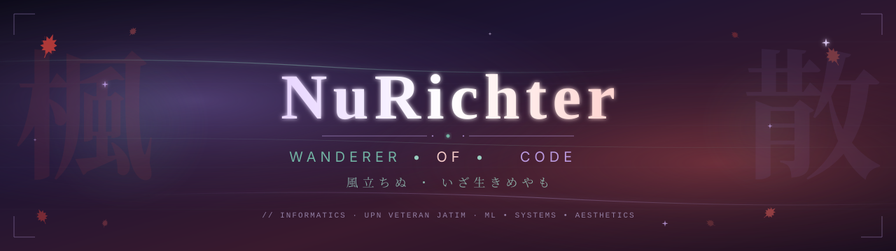

<!--
  ╔══════════════════════════════════════════════════════════════════╗
  ║                                                                  ║
  ║    NuRichter · A wanderer's letter to the Wanderer               ║
  ║                                                                  ║
  ║    ✦ Banner asset:    ./assets/banner.svg                        ║
  ║    ✦ Snake workflow:  ./.github/workflows/snake.yml              ║
  ║    ✦ Portfolio:       https://nurichter-workspace.vercel.app/    ║
  ║                                                                  ║
  ╚══════════════════════════════════════════════════════════════════╝
-->

<div align="center">

  <a href="https://nurichter-workspace.vercel.app/">
    
  </a>

  <br/><br/>

  <a href="#"></a>

  <br/><br/>

  <a href="https://nurichter-workspace.vercel.app/"></a>
  <a href="https://github.com/NuRichter?tab=followers"></a>
  
  <a href="https://github.com/NuRichter?tab=repositories"></a>

</div>

<br/>

<!-- ═══════════════════════════════════════════════════════════════════ -->
<!--   §  A Wanderer's Letter                                            -->
<!-- ═══════════════════════════════════════════════════════════════════ -->

## <samp>§ &nbsp; A Wanderer's Letter</samp>

<table>
  <tr>
    <td width="55%" valign="top">

> *"By the end, where's my Scara?"*  
> ...my bio asks the wind every time I refresh ^^

Hi ! I'm **NuRichter**, just a wanderer of code from somewhere on the archipelago (informatics undergrad, semester 4, perpetually behind on sleep). My bio is asking after a Wanderer with a red hat and a worse temper, and honestly that part of the joke is only halfway a joke :3

I like to think of every repo I push as a folded note left at a wind shrine. Some are loud and technical (ML pipelines for offshore wells, scrapers that hunt 10,000 academic PDFs, an Electron upscaler GUI). Some are softer (cosplay edits, dotfiles colour-matched at 3 AM, a kawaii Arch distro that exists mostly because it makes me happy). All of them are postcards to a Wanderer i haven't met yet.

If one of these speaks to you, then maybe the wind already carried your name back to me ♡

  </td>
    <td width="45%" valign="top" align="center">
      <br/>
      
    </td>
  </tr>
</table>

<br/>

<!-- ═══════════════════════════════════════════════════════════════════ -->
<!--   §  The Shrine I Keep (Portfolio Highlight)                        -->
<!-- ═══════════════════════════════════════════════════════════════════ -->

## <samp>§ &nbsp; The Shrine I Keep</samp>

<div align="center">

If skimming GitHub repos feels like rummaging through someone's drafts (which, fairly, that's exactly what they are ^^;) the cleaner route is right here:

<br/>

<a href="https://nurichter-workspace.vercel.app/">
  
</a>

<br/>

<sub><i>polished write-ups · proper screenshots · the projects i'm actually proud of</i></sub>

<br/><br/>

</div>

It's where I keep things in shape. Repos here on GitHub are more like the workshop floor, with shavings and half-finished drafts (>///<) the workspace site is the front gallery, with the lighting on.

<br/>

<!-- ═══════════════════════════════════════════════════════════════════ -->
<!--   §  Where I've Wandered Lately                                     -->
<!-- ═══════════════════════════════════════════════════════════════════ -->

## <samp>§ &nbsp; Where I've Wandered Lately</samp>

```yaml
trails i'm walking right now:
  bibliotech:        # IA & wireframe ETS, our digital library
    party:           7 wanderers strong
    role:            i map the rooms before the books arrive

  pkmkc-2026:        # AgriHex-SkyCure, eyes-in-the-sky for sick crops
    role:            anggota 3 (the careful one ^^)
    similarity:      24%   # safely under the 25% turnitin gate

  scraper-v3.1:      # hunting class-diagram PDFs across indonesian repos
    target:          10,000 files
    method:          sneaky bahasa-first search expansion

trails resting in the satchel:
  wellsense:         # ai/ml well monitoring, IOC hackathon era
  archrichter:       # bspwm/arch dotfiles, lovingly over-documented
  xupscaler:         # electron + ncnn vulkan upscaler app
```

<br/>

<!-- ═══════════════════════════════════════════════════════════════════ -->
<!--   §  Tools I Carry on the Road                                      -->
<!-- ═══════════════════════════════════════════════════════════════════ -->

## <samp>§ &nbsp; Tools I Carry on the Road</samp>

<div align="center">

**◇ languages**


**◇ machine learning &amp; data**


**◇ web &amp; systems**


**◇ environment**


</div>

<br/>

<!-- ═══════════════════════════════════════════════════════════════════ -->
<!--   §  Telemetry of the Journey                                       -->
<!-- ═══════════════════════════════════════════════════════════════════ -->

## <samp>§ &nbsp; Telemetry of the Journey</samp>

<div align="center">

  
  

</div>

<br/>

<details>
  <summary><samp>&nbsp;<b>◇ contribution graph (snake)</b>, click to expand ^^</samp></summary>
  <br/>
  <picture>
    <source media="(prefers-color-scheme: dark)" srcset="https://raw.githubusercontent.com/NuRichter/NuRichter/output/github-snake-dark.svg"/>
    <source media="(prefers-color-scheme: light)" srcset="https://raw.githubusercontent.com/NuRichter/NuRichter/output/github-snake.svg"/>
    
  </picture>
</details>

<br/>

<!-- ═══════════════════════════════════════════════════════════════════ -->
<!--   §  Outside the Trail                                              -->
<!-- ═══════════════════════════════════════════════════════════════════ -->

## <samp>§ &nbsp; Outside the Trail</samp>

When the terminal is closed for the night, you might catch me:

- 📷 &nbsp; cosplaying **Kazuha** (and pulling off the **KazuScara** duo whenever there's a willing Wanderer at the convention :3)
- 🎨 &nbsp; running **ComfyUI** workflows on the RTX 5070 Ti and 5060 Ti, mostly for image upscaling, occasionally for self-indulgent edits
- 🐧 &nbsp; ricing my **BSPWM** setup, where colour-matching the polybar to the wallpaper is a perfectly normal Tuesday evening
- 🇯🇵 &nbsp; pretending I can read **Japanese** fluently. I cannot, but the kanji is so pretty ^^

<br/>

<!-- ═══════════════════════════════════════════════════════════════════ -->
<!--   §  A Note for the Wind                                            -->
<!-- ═══════════════════════════════════════════════════════════════════ -->

<div align="center">

  <br/>

  <samp>
    <i>「 散らずとも いつかは落ちる 紅葉かな 」</i>
    <br/><br/>
    <sub>even unscattered, the maple will one day fall.<br/>
    so if you happen to find this leaf,<br/>
    please catch it gently ♡</sub>
  </samp>

  <br/><br/>

  <a href="https://nurichter-workspace.vercel.app/"></a>
  <a href="https://github.com/NuRichter"></a>

  <br/><br/>

  

</div>
